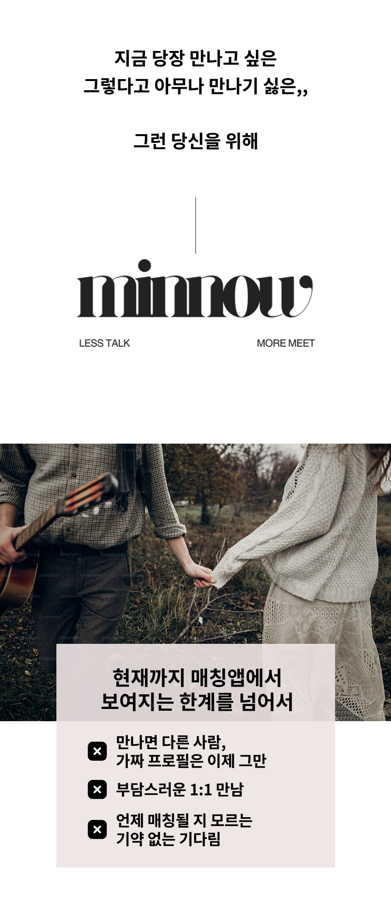
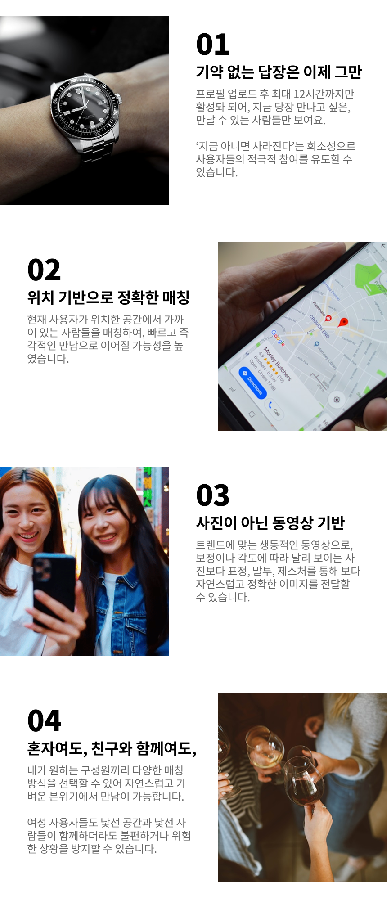
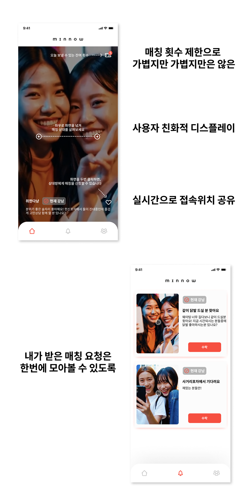
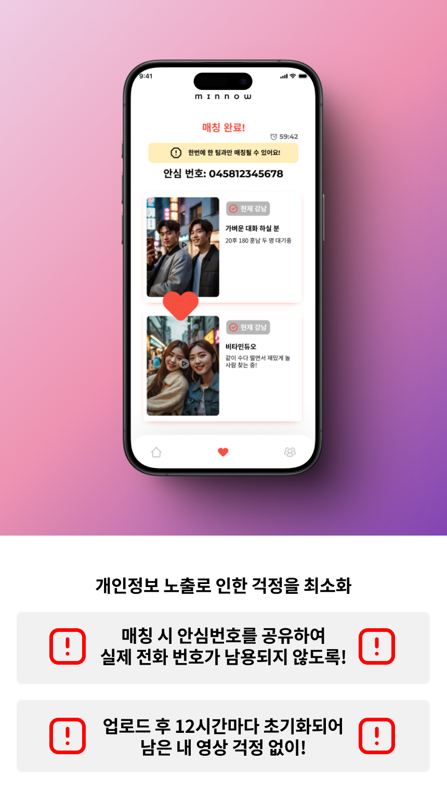
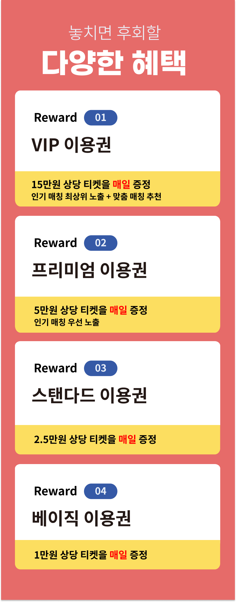
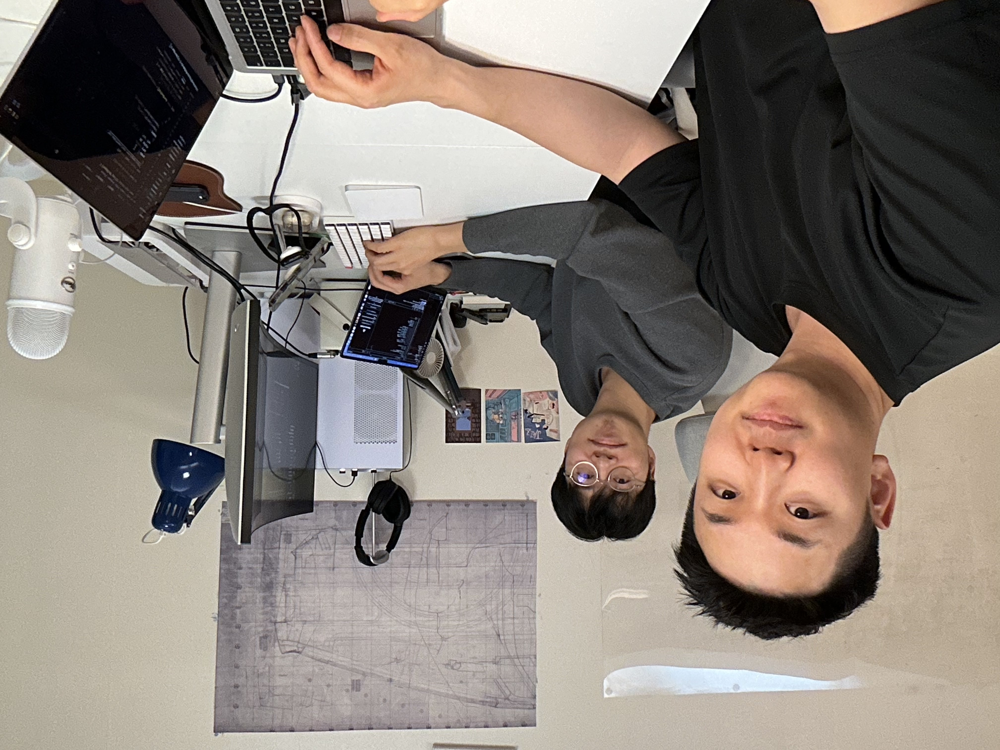
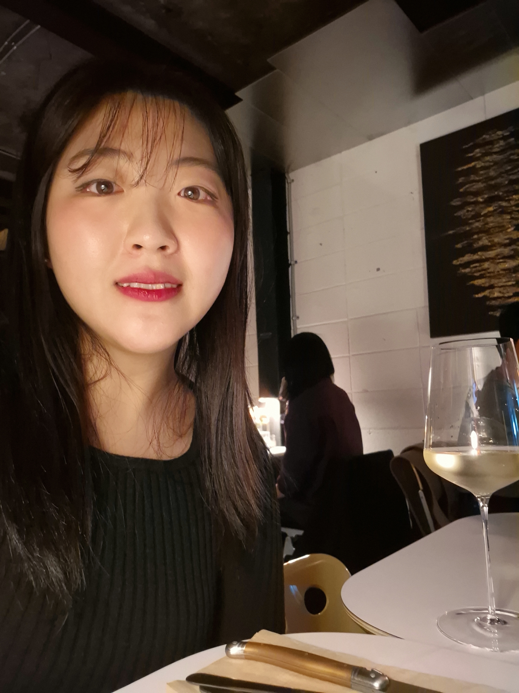

# MINNOW - 새로운 만남을 위한 소셜 모임 앱

# 소개

새로운 사람들과 어울리고 싶지만 어디서부터 어떻게 시작해야 할지 막막했던 적 있으신가요?  
**MINNOW(민나우)**는 그런 고민에서 시작된 프로젝트입니다.

소개팅 앱이나 만남이 부담스럽게 느껴지는 분들을 위해,  
같은 공간에서 자연스럽게 새로운 인연을 만들 수 있는 방법을 고민했습니다.  
그 결과 탄생한 것이 **지금, 여기서 만날 수 있는 즉석 모임 앱 MINNOW**입니다.

초기 테스트에서 가능성을 확인했고, 더 나은 서비스를 만들기 위해  
지금 **크라우드펀딩**을 진행하고 있습니다.

---

# 📅 예상 어플 일정

- **2025년 03월 01일**: 어플 개발 시작
- **2025년 06월 01일**: 어플 개발 및 테스트 진행
- **2025년 07월 01일**: 어플 개발 완료  
  _(일정이 변경되는 경우 새소식을 통해 알려드리겠습니다.)_

---

# 1. 왜 이런 프로젝트를 시작했나요?

현대인들은 새로운 사람을 만나고 싶어도 마땅한 기회를 찾기 어렵습니다.  
기존 소개팅이나 길거리 만남은 부담스럽거나 부자연스러운 경우가 많았죠.

저희는 **자연스럽고 부담 없는 만남**을 만들고자 MINNOW를 기획했습니다.

- **자연스러운 만남의 필요성**  
  친구들과 우연히 합석해 대화하듯, 낯선 사람과도 편하게 어울릴 수 있는 공간을 만들고자 했습니다.

- **아이디어의 실험과 검증**  
  가까운 지인들과 베타 테스트를 진행한 결과, “편한 만남은 처음이다”, “부담 없이 대화할 수 있어 좋았다”는 긍정적 반응을 받았습니다.

- **크라우드펀딩 도전**  
  초기 반응을 바탕으로 서비스를 발전시키기 위해, **와디즈**를 통해 더 많은 피드백을 받고자 합니다.

---

# 2. 우리의 이야기

MINNOW가 추구하는 **핵심 가치**는 세 가지입니다:

## ✅ 지금, 여기에서 만날 수 있는 새로운 인연

현재 내 주변에 있는 사람들과 **즉석에서 가볍게** 만날 수 있습니다.  
카페나 코워킹 공간에서 혼자 있을 때, MINNOW로 근처 사람과 **합석**이 가능합니다.

## ✅ 안전하고 부담 없는 만남

- **실명 인증**, **매너 평가 시스템**, **신고 및 차단 기능**을 통해 안전한 만남 보장
- **신뢰도 기반 매칭**으로 불쾌한 경험 최소화
- 24시간 모니터링 시스템 운영

## ✅ 빠르고 쉬운 연결

- 복잡한 절차 없음
- 프로필 작성 없이도 **단 몇 초 만에 합석 신청** 가능
- 앱을 켜고 "합석하기" 한 번이면 새로운 인연과 연결됩니다

---

# 3. 와디즈를 선택한 이유

많은 플랫폼 중 **와디즈**를 선택한 이유는 다음과 같습니다:

- 대한민국에서 **가장 활발한 크라우드펀딩 커뮤니티**
- 트렌드에 민감하고, 새로운 아이디어를 응원하는 서포터 분들이 많음
- 단순한 자금 모집이 아닌, **사용자와 함께 만드는 여정**

---

# 4. FAQ

### Q1. MINNOW는 기존 소개팅 앱과 무엇이 다른가요?

**A.**  
MINNOW는 온라인 매칭이 아닌 **오프라인 즉석 만남**을 지향합니다.  
현장에서 바로 합석하여 대화할 수 있는 **현실 기반의 소셜 모임 앱**입니다.

---

### Q2. 앱 이용 시 안전은 어떻게 보장되나요?

**A.**

- **본인 인증**을 통한 신원 확인
- **매너 평가**, **불쾌 행위 신고**, **24시간 모니터링**
- **평판이 낮은 사용자 제재 시스템** 운영

---

### Q3. 후원금은 어떻게 사용되나요?

**A.**

- 앱 개발 마무리
- 서버 확충 및 유지비
- 초기 운영비
- 사용자 피드백 반영을 위한 추가 개발 등에 사용됩니다

---

### Q4. 리워드 발송 및 문의처는 어떻게 되나요?

**A.**

- 리워드는 **프로젝트 오픈일에 이메일로 일괄 전송**됩니다.
- 문의는 **admin@seoulappstudio.com**으로 메일 주시면  
  평일 9시~6시 사이에 답변해드립니다.

---

# 5. 메이커 소개

  
  

안녕하세요! **서울앱스튜디오**입니다.  
저희는 스타트업을 꿈꾸는 세 친구로 구성된 팀으로,  
각자의 전문성을 모아 **MINNOW**를 개발하고 있습니다:

- **김소진**  
  다양한 글로벌 마케팅 경험을 바탕으로  
  MINNOW의 브랜드 마케팅과 서비스 기획을 담당합니다.

- **권기현**  
  IT 스타트업 운영 경험을 바탕으로  
  서비스 개발과 UX/UI 설계를 맡고 있습니다.

- **오한영**  
  대기업 개발 경력을 기반으로  
  MINNOW의 백엔드 및 인프라를 책임집니다.

> “왜 이렇게 자연스럽고 부담 없는 만남은 찾기 어려울까?”  
> 이런 질문에서 출발한 아이디어로  
> 세 사람이 함께 고민하고 만든 프로젝트가 바로 MINNOW입니다.  
> **만남 문화를 바꾸기 위한 도전, 지금 시작합니다.**
